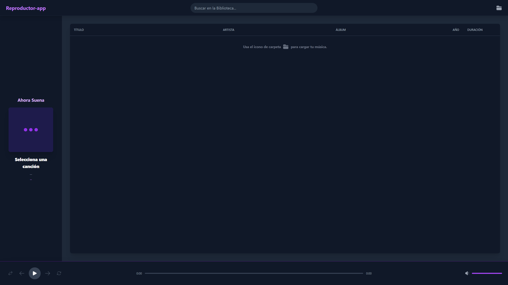

# 🎶 Reproductor-web 🎶 #

Este proyecto es un reproductor de música web, ligero y moderno, diseñado para ofrecer una experiencia de escucha fluida y agradable directamente desde tu navegador. Carga tu biblioteca de música local y disfruta de tus canciones favoritas con una interfaz limpia e intuitiva.

## ✨ Funcionalidades

Este reproductor de música cuenta con un conjunto completo de características para una experiencia de usuario excepcional:
 
- **Carga de Biblioteca Local**: El usuario puede seleccionar una carpeta de su ordenador para cargar archivos de música.
- **Extracción de Metadatos**: Se leen las etiquetas ID3 (título, artista, álbum, año y carátula) de cada canción.
- **Soporte de Formatos**: Reproduce los formatos de audio más comunes, incluyendo MP3, M4A (AAC, ALAC) y FLAC.
- **Controles de Reproducción Completos**:
  - Play, Pausa, Siguiente y Anterior.
  - Barra de progreso interactiva.
  - Control de volumen y silencio.
  - Modos de reproducción: Aleatorio (Shuffle) y Repetir (toda la lista o una sola canción).
- **Búsqueda en Tiempo Real**: Filtra la biblioteca de canciones mientras el usuario escribe.
- **Interfaz Responsiva**: Diseño limpio y funcional que se adapta a diferentes tamaños de pantalla.

## ✨ Tecnologías Utilizadas

Este proyecto fue construido utilizando un stack de tecnologías modernas para un desarrollo ágil y eficiente:
- Frontend: React con Vite para una interfaz de usuario dinámica.
- Estilos: Tailwind CSS para un diseño rápido y responsivo.
- Backend/Lógica: Node.js con TypeScript para una lógica robusta y tipada.

---
## 🚀 Cómo Empezar

Sigue estos pasos para configurar y ejecutar el proyecto en tu entorno local.

### Prerrequisitos
- Node.js (v18 o superior)
- npm, yarn, o pnpm

### Instalación y Ejecución
1. Clona el repositorio: `git clone https://github.com/Whatfck/Reproductor-app.git`
2. Navega al directorio del proyecto: `cd reproductor-web/reproductor-app`
3. Instala las dependencias: `npm install`
4. Inicia la aplicación: `npm run dev`

### Usando el Makefile

Para simplificar las tareas comunes de desarrollo, se ha incluido un `Makefile`. Puedes usar los siguientes comandos desde la raíz del proyecto:

- `make install`: Instala todas las dependencias.
- `make dev`: Inicia el servidor de desarrollo.
- `make build`: Compila la aplicación para producción.
- `make clean`: Elimina los artefactos de compilación y las dependencias.
- `make help`: Muestra una lista de todos los comandos disponibles.

---

## 🧑‍💻 Autor

Este proyecto fue desarrollado por: ***[@Whatfck](https://github.com/Whatfck)***  

## 📄 Licencia
Este proyecto está bajo la Licencia [**MIT**](LICENSE).